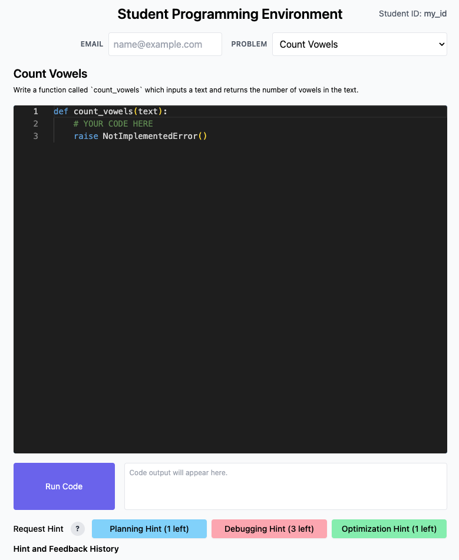
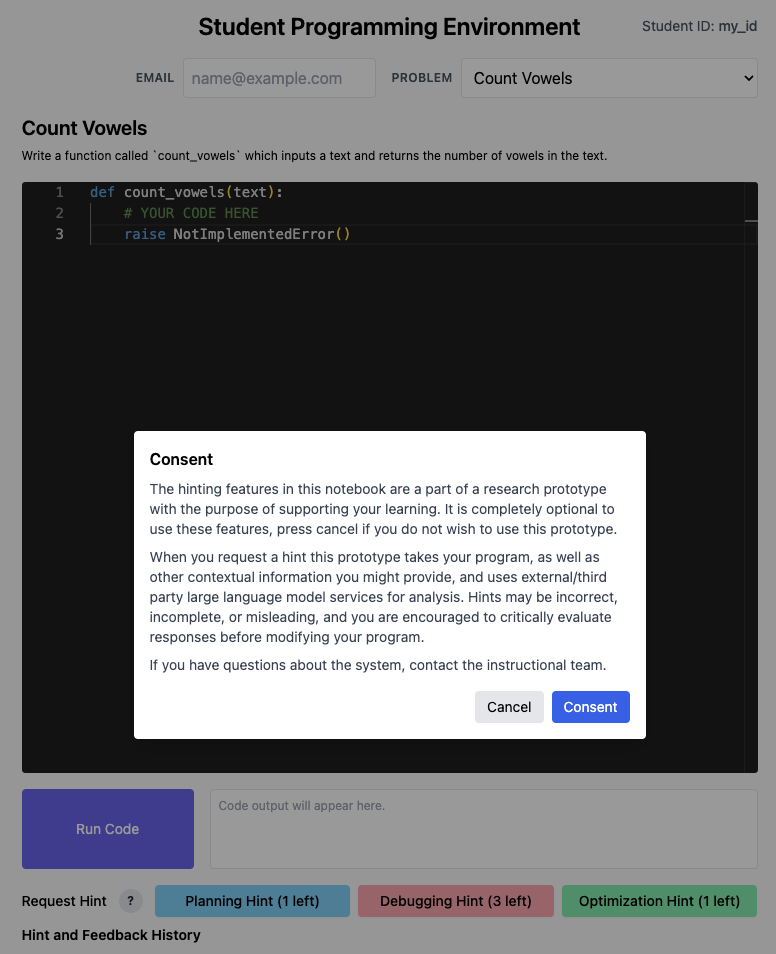
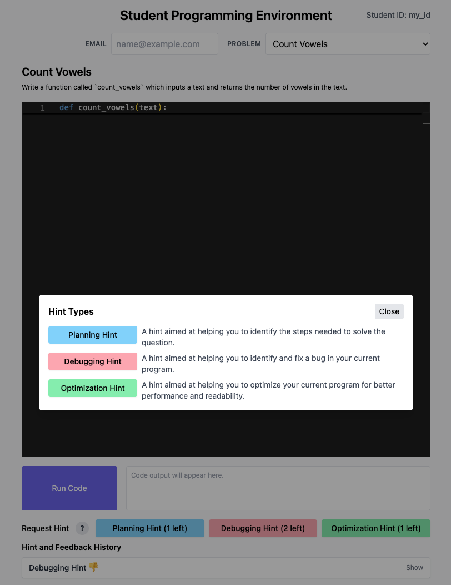
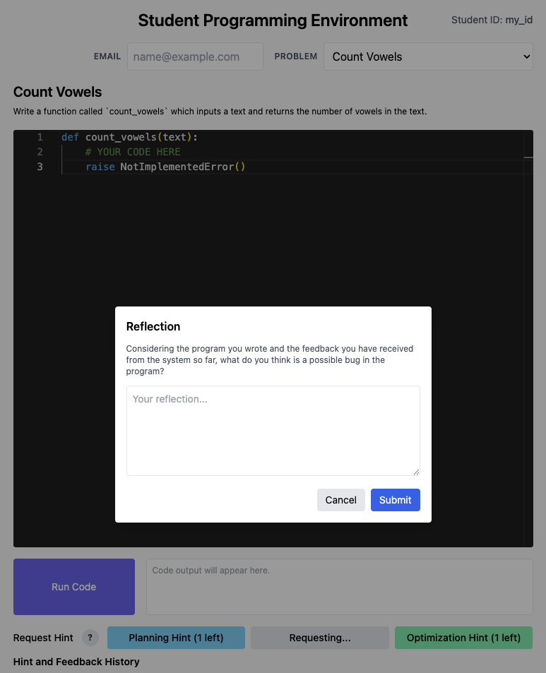
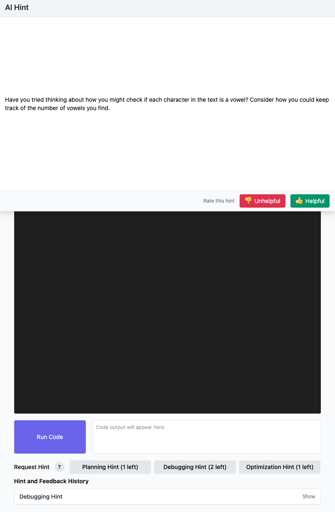
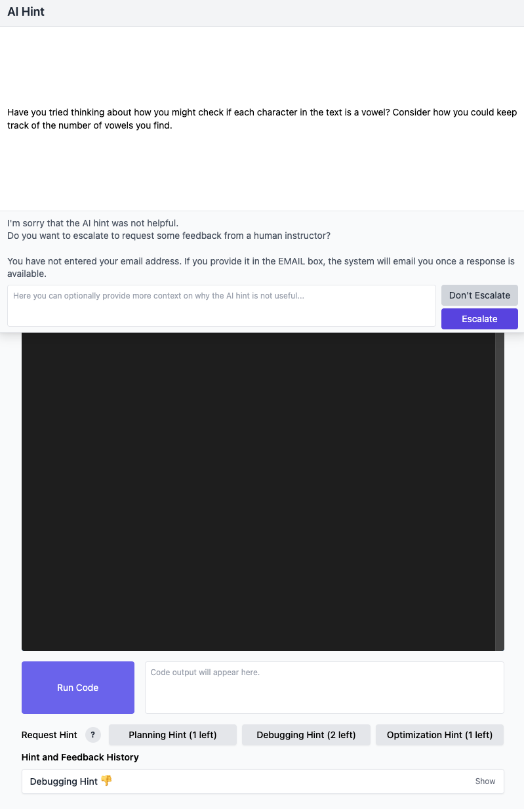
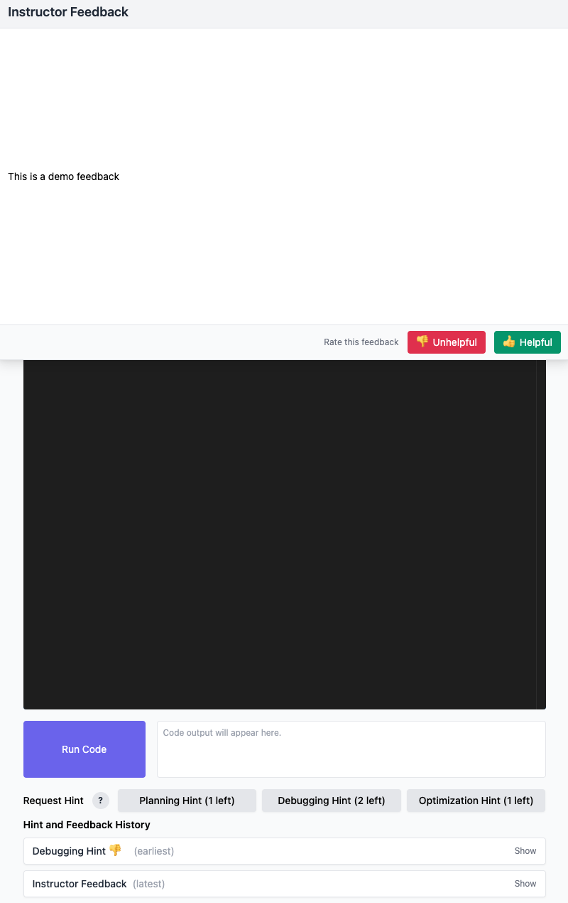
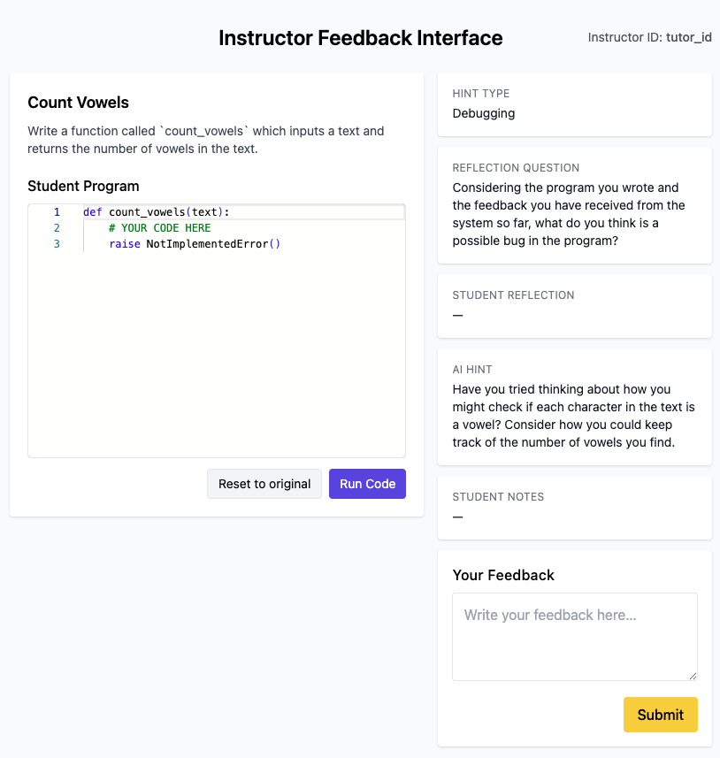
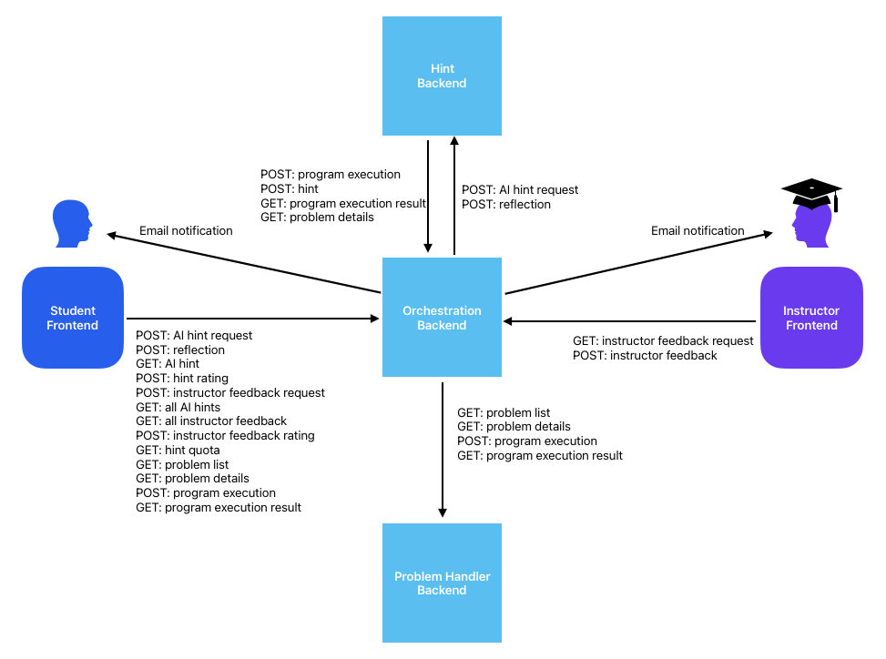

# Closing the Loop: An Instructor-in-the-Loop AI Assistance System for Supporting Student Help-Seeking in Programming Education

This repository contains the full codebase for the hybrid (AI + human instructor) help system described in the [SIGCSE TS 2026](https://sigcse2026.sigcse.org/) paper [Closing the Loop: An Instructor-in-the-Loop AI Assistance System for Supporting Student Help-Seeking in Programming Education](https://arxiv.org/abs/2510.14457).

This is a multi-service platform for interactive programming practice with AI-generated hints and human instructor feedback. The system “closes the loop” between: (1) students writing and running code, (2) AI pipelines that analyze and generate personalized hints, and (3) instructors who step in when AI help is insufficient.


## Illustrative screenshots:

### Student frontend:


0. Student programming environment.

<a href="screenshots/student_frontend_environment.png"></a>

1. Consent the use of the system.

<a href="screenshots/student_frontend_consent.png"></a>

2. (Optional) View description of the three hint types.

<a href="screenshots/student_frontend_hint_description.png"></a>

3. Click one of the type buttons to request hint. Reflect on the problem.

<a href="screenshots/student_frontend_reflection.png"></a>

4. Retrieve AI-generated hints based on the buggy code and reflection

<a href="screenshots/student_frontend_hint.png"></a>

5. Optional to escalate the request to instructors if the hint is rated as unhelpful.

<a href="screenshots/student_frontend_escalation.png"></a>

6. Retrieve instructor feedback if escalated.

<a href="screenshots/student_frontend_feedback.png"></a>


### Instructor frontend:

Review student's request and provide feedback.




## Component Overview

| Layer | Folder | Tech | Responsibility |
|-------|--------|------|----------------|
| Student Frontend | `frontend_student/` | React + TS + Vite + Tailwind + Monaco | Student problem workspace: run code, request AI hints, escalate for instructor feedback, view history & quotas. |
| Instructor Frontend | `frontend_instructor/` | React + TS + Vite + Tailwind + Monaco | Minimal dashboard for instructors to fetch a queued feedback request and submit a response. |
| Orchestration Backend | `backend_orchestration/` | Django | Single public API surface for both frontends. Brokers problem metadata & execution, AI hint lifecycle, instructor feedback queue, quotas & ratings. Persists “student‑facing” state. |
| AI Hint Backend | `backend_hint/` | Django + background workers (LLM + code exec utilities) | Internal pipeline that evaluates student code, explores enhanced program variants, and produces structured hints. Only accepts requests from Orchestration. |
| Problem Handler Backend | `backend_problem_handler/` | Django | Canonical problem/task metadata & secure program execution (hidden tests, timing, output capture). Accessed only by Orchestration + AI Hint backends. |
| Alternative Student Frontend (JupyterLab extension) | `frontend_student_jx/` | JupyterLab extension (TypeScript) | Alternative student frontend implemented as a JupyterLab extension that integrates hint-request UI directly into Jupyter notebooks. This frontend will be described near the end of this document. Before that, discussions focus on `Student Frontend`. |

Key rules:
* Only the Orchestration backend is contacted by the frontends.
* AI Hint & Orchestration call Problem Handler for execution & problem metadata.
* AI Hint backend never calls frontends directly; it writes back results via Orchestration’s polling model.

## Primary Flows



### 1. Student Requests an AI Hint
1. Student selects problem & enters (or leaves empty) code in the student frontend.
2. Frontend posts to Orchestration: `POST /ai_hint/add_request/` (stores `AIHintRequest`).
3. Orchestration forwards to AI Hint backend: `POST /ai_hint/add_request/` (internal) with shared `request_id`.
4. AI Hint backend enqueues tasks: run buggy program, generate/select enhanced programs, generate hint.
5. Student is prompted for reflection; frontend sends `POST /ai_hint/add_reflection/` → Orchestration → AI Hint backend.
6. Frontend polls `GET /ai_hint/query_hint/?request_id=...` until `job_finished` or error.
7. Student rates hint via `POST /ai_hint/save_hint_rating/`; rating may unlock instructor escalation UI if “unhelpful”.

### 2. Escalation to Instructor Feedback
1. After marking a hint unhelpful and entering notes for instructors (which can possibly be empty) via the escalation UI, frontend sends `POST /instructor_feedback/add_request/` referencing the `AIHintRequest` id (optionally student email & notes).
2. Orchestration creates `InstructorFeedback` row (queued state).
3. Instructor frontend fetches a pending request (e.g., `fetch_request` endpoint) and displays details (problem, code, hint, reflection, notes).
4. Instructor submits feedback `save_feedback`; Orchestration finalizes record (sets `request_fulfilled` & timestamps).
5. Student sees updated history including instructor response.

### 3. Program Execution
* Student frontend (and AI Hint backend indirectly) requests `POST /problems/execute_program/` at Orchestration.
* Orchestration proxies payload to Problem Handler’s execution endpoint and returns correctness, error output, and timing.

## Core Data Relationships (Orchestration DB)

* `AIHintRequest` — canonical record for a student hint lifecycle (request → reflection → hint result → rating).
* `Hint` — the actual AI-generated hint content, status, and metadata linked to an `AIHintRequest`.
* `InstructorFeedback` — one-to-one with an `AIHintRequest` when escalated; holds request information & final response.

Internal (AI Hint backend) pipeline models mirror and enrich the process (e.g., `Request`, `ProgramEnhancementPhase`, `EnhancedProgram`, `HintGenerationPhase`). These are not exposed directly to the frontends.

## Quotas & Ratings
* Orchestration enforces per-student global and per-hint-type quotas (`GET /ai_hint/quota_left/`) for each problem.
* UI performs optimistic quota decrements; failures revert counts.
* On startup, the student app loads AI hints and instructor feedback and auto-selects the earliest unrated item.

## Repository Layout (Top-Level Essentials)

```
compose.yaml                 # Multi-service Docker composition
backend_orchestration/       # Public API & coordination layer
backend_hint/                # AI hint generation pipeline (internal)
backend_problem_handler/     # Problem metadata & secure execution
frontend_student/            # Student-facing UI
frontend_instructor/         # Instructor-facing UI
*/user_customizable_configs/   # Per-backend configurable YAML/quotas/templates
```

See per-component READMEs in their folders for deeper specifics.

## User-customizable configurations

Each backend exposes a `user_customizable_configs/` folder to let adopters tailor behavior without forking core code. These configs are loaded at runtime by the respective services  (using the `*loader.py` files in the corresponding folder):

- Orchestration (`backend_orchestration/user_customizable_configs/`)
	- Quotas: YAML for per-student/per-problem limits.
	- Instructor feedback: assignment and email templates/configuration.

- AI Hint (`backend_hint/user_customizable_configs/`)
	- AI model/config: model names, temperature.

- Problem Handler (`backend_problem_handler/user_customizable_configs/`)
	- Programming tasks metadata: `programming_tasks/` including `task_metadata.yaml`, `task_descriptions/`, `template_code/`, `test_templates/`, `test_cases/`, and `execution_boxes/`.

You can safely update these YAML/text files and restart the affected backend to apply changes. Avoid committing secrets into these files; keep credentials in `.env` files.

## Running the System

### Local Development Setup

#### Prerequisites
* Python 3.13+
* Node.js 18+

#### 1. Backends (5 terminals or background processes)

##### Running backends with Docker Compose (recommended)

From the repository root:
```
docker compose up --build
```
Adjust exposed ports in `compose.yaml` if conflicts arise. Frontends may still be run locally (hot reload) against containerized backends by pointing `VITE_ORCH_BASE_URL` to the mapped orchestration port.

Compose services (as of now):
- backend-orchestration: Django API on 8000
- backend-hint: Django API on 8001
- backend-hint-worker: background workers consuming RabbitMQ tasks (replicas configurable)
- backend-problem-handler: Django API on 8002
- backend-problem-handler-worker: background workers for execution tasks (replicas configurable)
- postgresdb: Postgres database used by orchestration and hint backends
- rabbitmq: AMQP broker (5672) with management UI (15672)

Notes
- All three backends are now included in `compose.yaml`.
- Both AI hint and problem handler backends have worker services. You can adjust replica counts in the compose file under `deploy.replicas`.
- Ensure orchestration environment variables point to the container hostnames/ports if you customize networking (e.g., `http://backend-problem-handler:8002/...`).

##### Running backends manually (without Docker)

Run each of the following in separate terminals:
```
cd backend_orchestration   && pip install -r requirements.txt && python manage.py migrate && python manage.py runserver 0.0.0.0:8000

cd backend_hint            && pip install -r requirements.txt && python manage.py migrate && python manage.py runserver 0.0.0.0:8001

cd backend_hint            && python manage.py run_worker   # for background tasks

cd backend_problem_handler && pip install -r requirements.txt && python manage.py migrate && python manage.py runserver 0.0.0.0:8002

cd backend_problem_handler && pip install -r requirements.txt && python manage.py migrate && python manage.py run_worker   # for background tasks
```

#### 2. Frontends (2 terminals)
```
cd frontend_student    && npm install && npm run dev   # default http://localhost:5173
cd frontend_instructor && npm install && npm run dev   # default http://localhost:5174
```

Ensure CORS/trusted origins in Orchestration settings include both dev URLs (see `.env.example`).

#### 3. Test a Flow
Open the student frontend, set a Student ID, pick a problem, run code, request a hint, reflect, and observe polling. Mark returned AI hint as unhelpful to be able to escalate. Open the instructor frontend to fetch and respond to the feedback request. Then, return to the student frontend to see the response. 


#### Notes on Environment Variables

Each service contains a `.env.example` to get you started; copy it to `.env.local` (preferred) or `.env` and customize.

Frontends (`.env` or `.env.local`):
```
VITE_ORCH_BASE_URL=http://localhost:8000
```

> Tip: Maintain separate `.env` per backend; do not leak secrets into the frontends—they are bundled client-side.


### Deploying to Heroku (3 backends + 2 SPAs)

This section describes how to deploy this system on Heroku. On Heroku you will create three apps (one per backend). The Orchestration app also serves both SPAs as static files under `/student/` and `/instructor/`.

High-level overview
- 3 Heroku apps: Orchestration, AI Hint, Problem Handler.
- Frontends are built locally into `backend_orchestration/frontend_build/` and committed; Orchestration serves them via WhiteNoise.
- Both AI Hint and Problem Handler require a running worker dyno for background processing.

#### 0) Prerequisites
- Heroku CLI installed and logged in.
- Heroku add-ons:
	- Orchestration: Heroku Postgres.
	- AI Hint: Heroku Postgres + CloudAMQP.
	- Problem Handler: Heroku Postgres + CloudAMQP.

(Below instructions also show how to provision these via CLI.)

#### 1) Create Heroku apps and remotes
Pick your own app names; below we’ll use placeholders. Run from repo root:

```bash
# Orchestration app
heroku create <orch-app>
git remote add heroku-orch https://git.heroku.com/<orch-app>.git

# AI Hint app
heroku create <hint-app>
git remote add heroku-hint https://git.heroku.com/<hint-app>.git

# Problem Handler app
heroku create <prob-app>
git remote add heroku-prob https://git.heroku.com/<prob-app>.git
```

Ensure buildpacks: Python only for all three apps:
```bash
heroku buildpacks:clear -a <orch-app>
heroku buildpacks:add heroku/python -a <orch-app>

heroku buildpacks:clear -a <hint-app>
heroku buildpacks:add heroku/python -a <hint-app>

heroku buildpacks:clear -a <prob-app>
heroku buildpacks:add heroku/python -a <prob-app>
```

#### 2) Provision add-ons (recommended)
- Databases:
```bash
heroku addons:create heroku-postgresql:essential-0 -a <orch-app>
heroku addons:create heroku-postgresql:essential-0 -a <hint-app>
heroku addons:create heroku-postgresql:essential-0 -a <prob-app>
```
- RabbitMQ (CloudAMQP) for Hint and Problem Handler:
```bash
heroku addons:create cloudamqp:lemur -a <hint-app>
heroku addons:create cloudamqp:lemur -a <prob-app>

# Map CLOUDAMQP_URL to the RABBITMQ_URL expected by code
heroku config:set RABBITMQ_URL="$(heroku config:get CLOUDAMQP_URL -a <hint-app>)" -a <hint-app>
heroku config:set RABBITMQ_URL="$(heroku config:get CLOUDAMQP_URL -a <prob-app>)" -a <prob-app>
```

#### 3) Configure environment variables
Set the minimum required vars per app. You can also do this manually via Dashboard → Settings → Config Vars or CLI.

See the `.env.example` files in each backend for an exhaustive list. Below are some examples.

Common Django settings (all apps):
```bash
heroku config:set DJANGO_SECRET_KEY="$(openssl rand -hex 32)" -a <app>
heroku config:set DJANGO_ALLOWED_HOSTS="<app>.herokuapp.com" -a <app>
heroku config:set CSRF_TRUSTED_ORIGINS="https://<app>.herokuapp.com" -a <app>
```

Orchestration URLs pointing to the other backends (replace with your app names). Let \<orch-app-domain>, \<hint-app-domain>, and \<prob-app-domain> be the respective subdomains Heroku assigned to your apps:
```bash
heroku config:set \
	BACKEND_PROBLEM_HANDLER_GET_PROBLEMS_URL=https://<prob-app-domain>.herokuapp.com/query/programming_problems/ \
	BACKEND_PROBLEM_HANDLER_EXECUTE_CODE_URL=https://<prob-app-domain>.herokuapp.com/execution/execute_program/ \
	BACKEND_PROBLEM_HANDLER_GET_EXECUTION_RESULT_URL=https://<prob-app-domain>.herokuapp.com/execution/get_execution_result/ \
	BACKEND_HINT_ADD_REQUEST_URL=https://<hint-app-domain>.herokuapp.com/ai_hint/add_request/ \
	BACKEND_HINT_ADD_REFLECTION_URL=https://<hint-app-domain>.herokuapp.com/ai_hint/add_reflection/ \
	-a <orch-app>
```

AI Hint (example):
```bash
heroku config:set \
	OPENAI_API_KEY=<your-openai-key> \
	ORCHESTRATION_BASE_URL=https://<orch-app-domain>.herokuapp.com \
	TASK_QUEUE=task_queue \
	QUEUE_MAX_PRIORITY=5 \
	-a <hint-app>
```

Problem Handler (queue settings):
```bash
heroku config:set \
	TASK_QUEUE=exec_task_queue \
	QUEUE_MAX_PRIORITY=2 \
	EXECUTE_PROGRAM_PRIORITY=1 \
	-a <prob-app>
```


#### 4) Build the frontends for production
The Orchestration app serves the SPAs from `backend_orchestration/frontend_build/`.

1) Set the base URL for production builds (replace with your orchestration URL):
```bash
echo "VITE_ORCH_BASE_URL=https://<orch-app-domain>.herokuapp.com" > frontend_student/.env.heroku
echo "VITE_ORCH_BASE_URL=https://<orch-app-domain>.herokuapp.com" > frontend_instructor/.env.heroku
```
2) Build and commit the assets:
```bash
cd frontend_student && npm install && npm run build:heroku && cd -
cd frontend_instructor && npm install && npm run build:heroku && cd -

# Commit the generated assets under backend_orchestration/frontend_build/
git add backend_orchestration/frontend_build frontend_*/.env.heroku
git commit -m "Build frontends for Heroku"
```

#### 5) Deploy each backend via git subtree
We push each subdirectory to its corresponding Heroku app. Using a temporary split branch avoids refspec issues.

```bash
# Orchestration
git subtree split --prefix backend_orchestration -b heroku-orch-branch
git push heroku-orch heroku-orch-branch:master

# AI Hint
git subtree split --prefix backend_hint -b heroku-hint-branch
git push heroku-hint heroku-hint-branch:master

# Problem Handler
git subtree split --prefix backend_problem_handler -b heroku-prob-branch
git push heroku-prob heroku-prob-branch:master
```

Heroku Procfiles already run `migrate` and `collectstatic` on release for each app.

#### 6) Scale dynos and verify
Enable web and worker dynos as needed:
```bash
heroku ps:scale web=1 -a <orch-app>
heroku ps:scale web=1 worker=1 -a <hint-app>
heroku ps:scale web=1 worker=1 -a <prob-app>
```

Check dyno status and logs:
```bash
heroku ps -a <prob-app>
heroku logs --tail -a <prob-app>
```
Look for lines like "Worker starting", "Worker consuming", and "Worker callback received" to confirm task processing.

#### 7) Test in production
- Open `https://<orch-app>.herokuapp.com/student/` and `https://<orch-app>.herokuapp.com/instructor/`.
- Execute a program and request hints. If execution polling turns into a 500 after a long wait, the Problem Handler worker likely isn’t running or cannot reach RabbitMQ — check the worker logs and `RABBITMQ_URL`.

#### Common Heroku pitfalls
- Wrong buildpack (Node on a Python app): clear and add `heroku/python` only.
- Missing worker dynos: scale `worker=1` for Hint and Problem Handler.
- Static 404s: ensure you built and committed `backend_orchestration/frontend_build/*`, and that release `collectstatic` ran.
- Misconfigured URLs between apps: verify the Orchestration env vars point to your `hint-app` and `prob-app` HTTPS endpoints.
- DJANGO_SETTINGS_MODULE set incorrectly in Config Vars: remove it unless explicitly required.


## Alternative Student Frontend:`frontend_student_jx`

There is an alternative Student frontend implemented as a JupyterLab extension in the `frontend_student_jx/` folder. This extension embeds hint-request UI directly into Jupyter notebooks and integrates with the same Orchestration API used by the other frontends.

Key points:
- Location: `frontend_student_jx/` (TypeScript sources in `frontend_student_jx/src/`, compiled output in `frontend_student_jx/lib/`).
- Entry point (source): `frontend_student_jx/src/index.ts`.
- Configurable question detection: `frontend_student_jx/src/user_customizable_configs/notebook_questions/questions.json` — an array of objects with fields:
	- `question_id` — string used as the `problem_id` when sending hint requests to the backend.
	- `question_start_grade_id` — the nbgrader `grade_id` of the markdown cell that marks the start of a question.
	- `question_end_grade_id` — the nbgrader `grade_id` of the cell that marks the end of a question's program (used to stop program extraction).
- Build steps (from the `frontend_student_jx/` folder):
```bash
cd frontend_student_jx
jlpm install            # installs dev deps (uses JupyterLab's yarn wrapper)
jlpm build:lib          # compile TypeScript to lib/
jlpm build:labextension:dev   # build the labextension in development mode (optional)
```
- Dev steps (from the `frontend_student_jx/` folder):
```bash
# In one terminal:
jlpm run watch          # rebuilds on source changes
# In another terminal:
jupyter lab             # run Jupyterlab
```	

